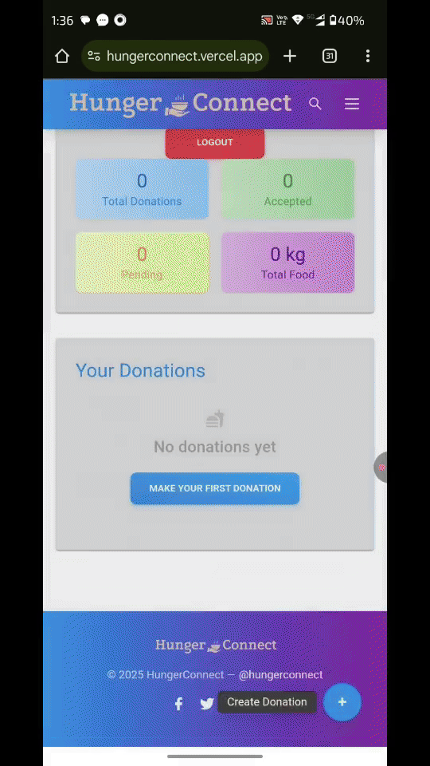
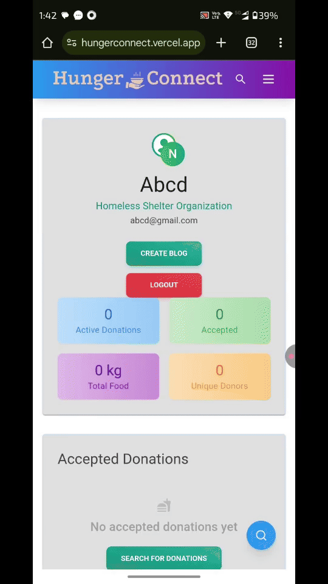
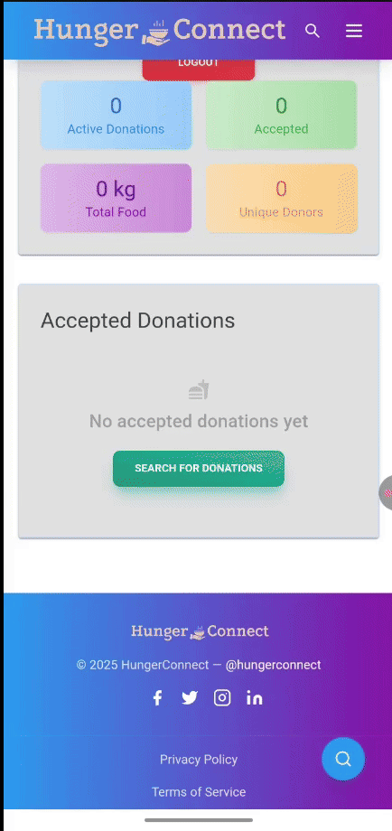

# 🍽️ Hunger Connect

**Hunger Connect** is a web platform inspired by the UN’s Sustainable Development Goal: **Zero Hunger**. It bridges the gap between food **donors** and **NGOs (distributors)** to minimize food wastage and ensure excess food reaches those in need.

Built using **React**, **Firebase**, **Tailwind CSS**, and **Vite**, and deployed with **Vercel**, the app offers real-time updates and seamless interaction between users.

---

## 🚀 Features

### 👤 Donor Side
- ➕ Add a donation by clicking the plus icon.
- 📋 Fill in details: food type, quantity, pickup location, date & time, contact info.
- 📄 View own donations.
- 📝 Create blog posts and delete them.

### 🏢 Distributor (NGO) Side
- 👀 View available donations.
- ✅ Accept and pick up donations.
- ❌ Withdraw from accepted donations if needed.
- 📍 View pickup locations and communication info.
- 💬 Comment on and ❤️ like blog posts.

### 📝 Blogs (Community Feed)
- Post experiences, updates, or awareness content.
- Like and comment on posts.
- View and manage own posts via navbar.

---

## 🌐 Tech Stack

| Technology     | Purpose                        |
|----------------|--------------------------------|
| React.js       | Frontend UI                    |
| Tailwind CSS   | Styling                        |
| Vite           | Build tool                     |
| Firebase Auth  | User Authentication            |
| Firebase DB    | Real-time Database (donations, blogs, users) |
| Firebase Storage | File/Image Storage          |
| Vercel         | Deployment                     |

---

## 🧑‍💻 Installation

### 🔧 Prerequisites

- Node.js and npm
- Tailwindcss
- Vite

### 📦 Setup Steps

```bash
# Clone the repository
git clone https://github.com/asingh-2112/hunger-connect.git
cd hunger-connect

# Install dependencies
npm install

# Run the development server
npm run dev

Hunger-Connect/
├── public/               # Static assets
├── src/
|   ├── assests/          # Images
│   ├── components/       # Reusable components (Navbar, BlogCard, DonationForm etc.)
│   ├── pages/            # Donor, NGO views
│   ├── firebase/         # Firebase configuration
│   ├── App.css/          # Style to app
│   ├── App.jsx           # Root app
│   ├── index.css/        # Style for index
│   └── main.jsx          # Entry point
├── tailwind.config.js
├── vite.config.js
└── package.json
```
---

### 🧭 Application Flow
1. Donor signs in → adds donation via form.

2. NGO signs in → browses available donations → accepts a donation.

3. NGO picks up food and can post a blog about the experience.

4. Both users can interact through blog likes and comments.

5. Navbar provides quick access to donation history and blog feed.

---

## 🌍 Live Demo
🔗 https://hungerconnect.vercel.app

## 📸 Screenshots

- ### Donation form
  

- ### Blog post flow
  

- ### NGO dashboard
  

---

### 💡 Inspiration
This project is inspired by the global challenge of **food waste** and the mission to ensure **zero hunger** for everyone. Built with the intent to make food distribution faster, smarter, and more equitable.
